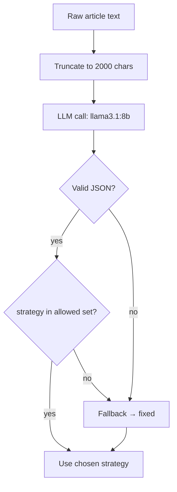
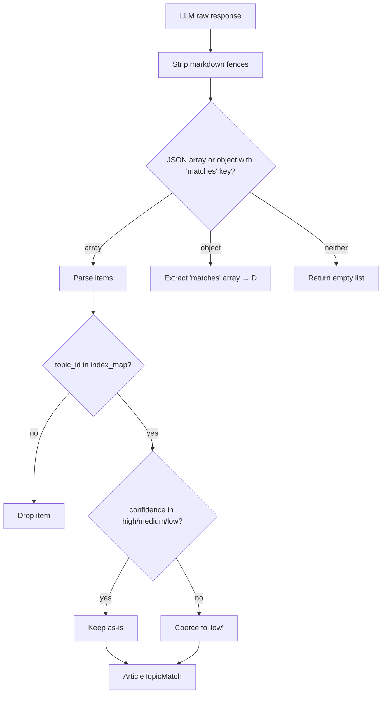
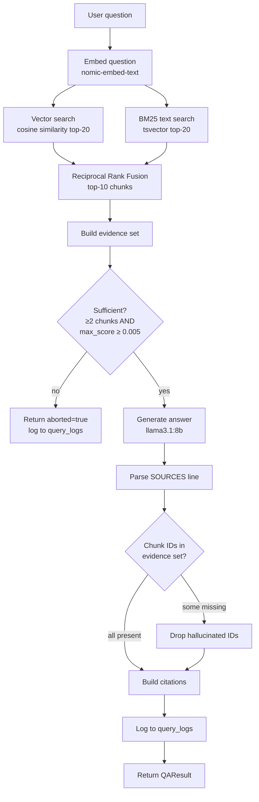
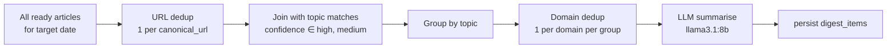
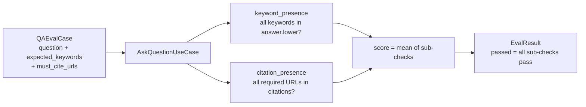

# Superbrain — Agentic and LLM Flows

This document covers every place where a language model makes a decision or generates content. For each LLM interaction, it describes the model used, the prompt structure, the expected output format, and how the system validates or falls back when the model produces unexpected output.

---

## Overview — Where LLMs Are Used

| Agent / Use | Model | Trigger | Output |
|---|---|---|---|
| Chunking strategy agent | llama3.1:8b | New article ingested | `{strategy: "semantic"\|"recursive"\|"fixed"}` |
| Topic classifier | phi3:mini | Article ready / topic updated | `[{topic_id, confidence, reason}]` |
| Grounded QA generator | llama3.1:8b | POST /qa/ask | Prose answer + `SOURCES:` line |
| Digest summariser | llama3.1:8b | Daily scheduler / manual trigger | 3-6 sentence prose per topic group |

---

## 1. Chunking Strategy Agent

**Location:** `src/superbrain/app/application/ingestion/chunking_agent.py`

### What it does

Before splitting an article into chunks, the system asks an LLM to inspect the raw text and choose the most appropriate chunking strategy. This is a classic "agent-as-decision-maker" pattern: the LLM observes inputs and selects an action from a fixed action space.

### Prompt structure

```
You are a text chunking expert. Given the following article, decide the best chunking strategy.

Output valid JSON only:
{"strategy": "semantic" | "recursive" | "fixed"}

- semantic: well-structured text with clear topic boundaries
- recursive: mixed structure, some paragraphs, some lists
- fixed: raw text, no structure, or very short content

Article (first 2000 chars):
{raw_text[:2000]}
```

### Decision logic



### Chunker implementations

| Strategy | Logic | Best for |
|---|---|---|
| `semantic` | Splits at sentence boundaries using NLTK punkt; merges until token budget (512) is reached | Well-structured prose |
| `recursive` | Tries paragraph → sentence → word boundaries in order | Mixed structure |
| `fixed` | Hard split every N tokens (512) with 64-token overlap | Raw / unstructured text |

All chunkers use tiktoken (`cl100k_base`) for token counting.

### Fallback guarantee

Any `json.JSONDecodeError`, missing key, or unexpected value causes a deterministic fallback to `"fixed"`. The pipeline never blocks on a bad LLM response.

---

## 2. Topic Classifier

**Location:** `src/superbrain/app/application/topics/classifier.py`

### What it does

Given an article and a list of active topics, the classifier decides which topics (if any) the article belongs to, and at what confidence level. Topics are referenced by integer index in the prompt to avoid confusing the model with UUID strings.

### Prompt structure

```
You are a content classifier. Given an article and a list of topics,
return a JSON array of matches.

Topics (use the integer ID in your response):
[1] {topic1.name}: {topic1.description}
    Examples: {topic1.examples}
[2] {topic2.name}: {topic2.description}
    ...

Article title: {title}
Article text (first 1500 chars): {raw_text[:1500]}

Output valid JSON only. Return [] if no topics match.
[{"topic_id": <integer>, "confidence": "high"|"medium"|"low", "reason": "<one sentence>"}]
```

### Index mapping

The prompt uses 1-based integer indices. The parser maintains a `dict[int, UUID]` mapping built just before the LLM call:

```python
index_map = {i + 1: topic.id for i, topic in enumerate(active_topics)}
```

After parsing, each `topic_id` integer is resolved to a UUID via `index_map`. Unknown integers are silently dropped.

### Output validation and coercion



**Hallucination guard:** any topic_id integer not present in `index_map` is silently discarded. The model cannot invent topic IDs because every valid ID was provided in the prompt.

**Confidence coercion:** any value outside `{high, medium, low}` (e.g. `"very_high"`, `"certain"`) is coerced to `"low"` rather than failing.

**Markdown fence stripping:** the model sometimes wraps its JSON in ```json … ``` fences. The parser strips these before attempting to decode.

---

## 3. Grounded QA Pipeline

**Location:** `src/superbrain/app/application/qa/`

This is the most complex agentic flow. It combines retrieval, evidence gating, generation, and hallucination rejection into a single synchronous pipeline.

### Full pipeline



### QA prompt structure

```
You are a factual assistant. Answer the question using ONLY the provided evidence chunks.

Evidence:
[1] (chunk_id={uuid}, url={url}) {chunk.content}
[2] (chunk_id={uuid}, url={url}) {chunk.content}
...

Question: {question}

Instructions:
- Answer in 2-5 sentences.
- Cite sources by chunk ID on a SOURCES line at the end.
- If the evidence does not answer the question, say "I don't have enough information."

SOURCES: {chunk_id_1}, {chunk_id_2}
```

### Evidence sufficiency gate

Two constants act as quality thresholds:

```python
MIN_EVIDENCE_CHUNKS = 2      # at least 2 chunks must be retrieved
MIN_EVIDENCE_SCORE = 0.005   # top chunk must have RRF score ≥ 0.005
```

If either threshold fails, the pipeline aborts without calling the LLM. This prevents hallucinated answers on topics not yet in the knowledge base.

### Citation parsing and hallucination rejection

After generation, `parse_answer_response()` extracts the `SOURCES:` line and validates each chunk ID against the evidence set:

```python
evidence_ids = {str(chunk.id) for chunk in fused_chunks}
# keep only IDs that were actually in the evidence
valid_citations = [cid for cid in parsed_ids if cid in evidence_ids]
```

Any chunk ID the model invented (not present in the evidence passed to it) is silently dropped. The answer text is returned as-is — only the citation list is filtered.

---

## 4. Digest Summariser

**Location:** `src/superbrain/app/application/digest/summariser.py`

### What it does

For each topic group in a digest run, the summariser calls the LLM once to produce a coherent prose summary of that group's articles. Calls are sequential (not parallel) to avoid Ollama queue pressure.

### Prompt structure

```
You are a news editor writing a daily digest section.
Summarise the following articles about "{topic_name}" in 3-6 sentences.
Write flowing prose — no bullet points, no headers.
Do not mention article titles directly. Do not invent facts.

Articles:
---
Title: {article.title}
URL: {article.url}
{article.raw_text[:800]}
---
... (repeated for each article in group)

Summary:
```

### Deduplication before summarisation

Before the LLM call, two deduplication steps reduce noise:

1. **URL dedup** (`deduplicate_by_url`): across all articles selected for the day, keep only the most-recently-ingested article per `canonical_url`.
2. **Domain dedup** (`deduplicate_sources_within_group`): within each topic group, keep at most one article per domain (e.g. only one `techcrunch.com` article per topic). When multiple articles from the same domain match the same topic, the highest-confidence match is kept.



### Group ordering

Topic groups are sorted by `topic.priority DESC`, then by article count DESC. The digest section list therefore surfaces high-priority topics first, and among equal-priority topics, the busiest topics appear first.

---

## 5. Model Call Logging

**Location:** `src/superbrain/app/infrastructure/llm/`

Every call to Ollama is wrapped by `OllamaLLM`, which records timing and outcome to `model_call_logs`:

```python
# pseudocode in OllamaLLM.generate()
t0 = time.monotonic()
try:
    response = await httpx_client.post(ollama_url, json=payload)
    duration_ms = int((time.monotonic() - t0) * 1000)
    await model_call_log_repo.save(ModelCallLog(
        request_type=prompt_template,
        model_name=self.model,
        duration_ms=duration_ms,
        status="success",
        related_entity_id=entity_id,
    ))
    return response.json()["response"]
except Exception as e:
    await model_call_log_repo.save(ModelCallLog(..., status="error"))
    raise
```

`related_entity_id` links the log row to the article, job, or digest run that triggered the call. This allows `GET /observe/jobs/{job_id}/trace` to reconstruct the full chain of model calls for any ingestion job.

---

## 6. Eval Harness

**Location:** `src/superbrain/app/application/evals/`

The eval harness provides automated quality checks without requiring human labellers. It runs on demand via `GET /observe/evals/run`.

### Retrieval eval

Measures whether the hybrid retrieval system finds expected chunks for known questions.

```mermaid
flowchart LR
    CASE[RetrievalEvalCase<br/>question + expected_chunk_ids<br/>+ expected_urls] --> VEC[VectorRetriever]
    CASE --> BM25[BM25Retriever]
    VEC --> RRF[RRF Fusion]
    BM25 --> RRF
    RRF --> RECALL[recall@k<br/>fraction of expected IDs found]
    RRF --> URLCOV[url_coverage<br/>fraction of expected URLs found]
    RECALL --> SCORE[score = mean recall + url_cov]
    URLCOV --> SCORE
    SCORE --> RESULT[EvalResult<br/>passed = score ≥ 0.5]
```

**recall@k:** `|retrieved_ids ∩ expected_ids| / |expected_ids|`

**url_coverage:** `|retrieved_urls ∩ expected_urls| / |expected_urls|`

### QA eval

Measures answer quality for known question-answer pairs.



**Groundedness check** (`check_groundedness`) is also available but runs outside the automatic harness — it verifies that every chunk ID cited in an answer was actually present in the evidence set passed to the LLM (structural check only; semantic correctness requires human review).

### EvalResult schema

```python
@dataclass
class EvalResult:
    name: str           # e.g. "retrieval:case_001" or "qa:case_003"
    passed: bool
    score: float        # 0.0 – 1.0
    details: str        # human-readable breakdown
    duration_ms: int
```

---

## 7. In-Memory Metrics

**Location:** `src/superbrain/app/application/metrics.py`

`InMemoryMetricsRecorder` implements the `MetricsRecorder` Protocol. It holds all counters and observation lists in process memory (no external store), making it zero-latency and zero-dependency.

```python
class MetricsRecorder(Protocol):
    def increment(self, name: str, value: int = 1) -> None: ...
    def observe(self, name: str, value: float) -> None: ...
    def snapshot(self) -> dict: ...
```

`snapshot()` returns:
- All counter values (integers)
- For each observation series: p50, p95, p99 computed from the full in-memory list

Thread safety is provided by a single `threading.Lock` around reads and writes. All asyncio code runs on one thread so contention is negligible; the lock protects against any incidental thread use.

The single shared instance is stored on `app.state.metrics` and injected into every use case at startup. Restarting the server resets all counters — this is intentional (metrics are for live operational insight, not durable timeseries).
