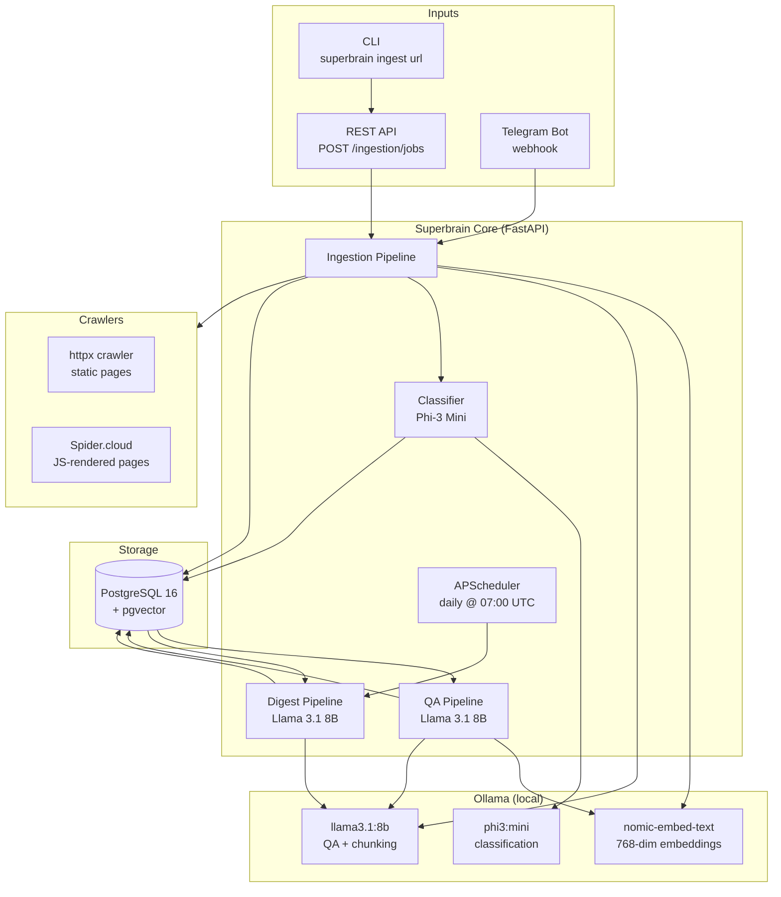
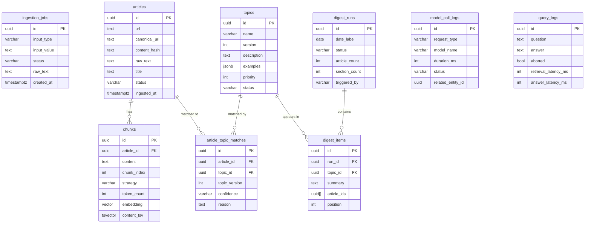

# Superbrain — Architecture

## Overview

Superbrain is a fully local agentic AI system. Every model call — embeddings, classification, chunking decisions, QA answers, digest summaries — runs on hardware you control via [Ollama](https://ollama.ai). There is no cloud AI dependency at runtime.

The system is built around a standard **hexagonal architecture** (also called ports-and-adapters): the domain and application layers are pure Python with no framework dependencies; infrastructure adapters (SQLAlchemy, httpx, Ollama, APScheduler) are plugged in at the boundary.

---

## Tech Stack

| Layer | Technology | Version |
|---|---|---|
| **API framework** | FastAPI | ≥ 0.115 |
| **ASGI server** | Uvicorn (with standard extras) | ≥ 0.30 |
| **Data validation** | Pydantic v2 + pydantic-settings | ≥ 2.7 |
| **Database** | PostgreSQL 16 with pgvector extension | — |
| **ORM** | SQLAlchemy (async) | ≥ 2.0 |
| **DB driver** | asyncpg | ≥ 0.29 |
| **Migrations** | Alembic | ≥ 1.13 |
| **Vector search** | pgvector (cosine similarity, ivfflat index) | ≥ 0.3 |
| **Full-text search** | PostgreSQL tsvector / GIN index (BM25-style) | — |
| **Local LLM runtime** | Ollama (HTTP API) | — |
| **Embedding model** | nomic-embed-text (768-dim) | via Ollama |
| **QA / chunking model** | llama3.1:8b | via Ollama |
| **Classification model** | phi3:mini | via Ollama |
| **Digest model** | llama3.1:8b (swap to lfm2-7b when available) | via Ollama |
| **HTTP client** | httpx (async) | ≥ 0.27 |
| **Web scraping** | httpx + BeautifulSoup4 (static) / Spider.cloud (JS) | — |
| **Tokenisation** | tiktoken (cl100k_base) | ≥ 0.7 |
| **Sentence splitting** | NLTK punkt tokenizer | ≥ 3.8 |
| **Telegram bot** | python-telegram-bot (webhooks) | ≥ 21.0 |
| **CLI** | Typer | ≥ 0.12 |
| **Scheduler** | APScheduler (AsyncIOScheduler) | ≥ 3.10 |
| **Structured logging** | structlog (JSON / console dual-mode) | ≥ 24.0 |
| **Runtime** | Python 3.12 |  |
| **Package manager** | uv | — |

---

## Architectural Layers

```
┌─────────────────────────────────────────────────────────────┐
│                        Entry Points                         │
│   FastAPI (HTTP)    Telegram bot    CLI (Typer)             │
└────────────────────────────┬────────────────────────────────┘
                             │
┌────────────────────────────▼────────────────────────────────┐
│                     Application Layer                       │
│   Use cases · Ports (interfaces) · MetricsRecorder          │
│   Pipelines: Ingestion · QA · Classification · Digest       │
└────────────────────────────┬────────────────────────────────┘
                             │
┌────────────────────────────▼────────────────────────────────┐
│                       Domain Layer                          │
│   Entities (pure dataclasses) · Repository contracts        │
│   Exceptions · No framework dependencies                    │
└────────────────────────────┬────────────────────────────────┘
                             │
┌────────────────────────────▼────────────────────────────────┐
│                   Infrastructure Layer                      │
│   SQLAlchemy repos · Ollama adapters · Crawlers             │
│   Chunkers · APScheduler · asyncpg                          │
└─────────────────────────────────────────────────────────────┘
```

---

## System Architecture Diagram



---

## Database Schema

Six domain tables plus three observability tables:



---

## Key Design Decisions

**Local-only by design.** No calls to OpenAI, Anthropic, or any cloud model provider. All inference runs through Ollama's local HTTP API. This makes the system fully air-gappable.

**Hexagonal architecture.** Use cases depend on abstract repository and port interfaces, not concrete implementations. Swapping the database or the LLM runtime requires only a new adapter — the application logic is unchanged.

**Async throughout.** FastAPI + asyncpg + httpx + APScheduler all run on the same asyncio event loop. No threads except for the metrics lock (fine-grained, sub-microsecond).

**Postgres as the only store.** Vector search (pgvector), full-text search (tsvector), relational joins, and JSONB metadata all live in one database. No separate vector DB, no Redis, no Elasticsearch.

**One session per request.** SQLAlchemy sessions are created at the start of each request (or background task) and closed at the end. No global session, no leaked connections.
