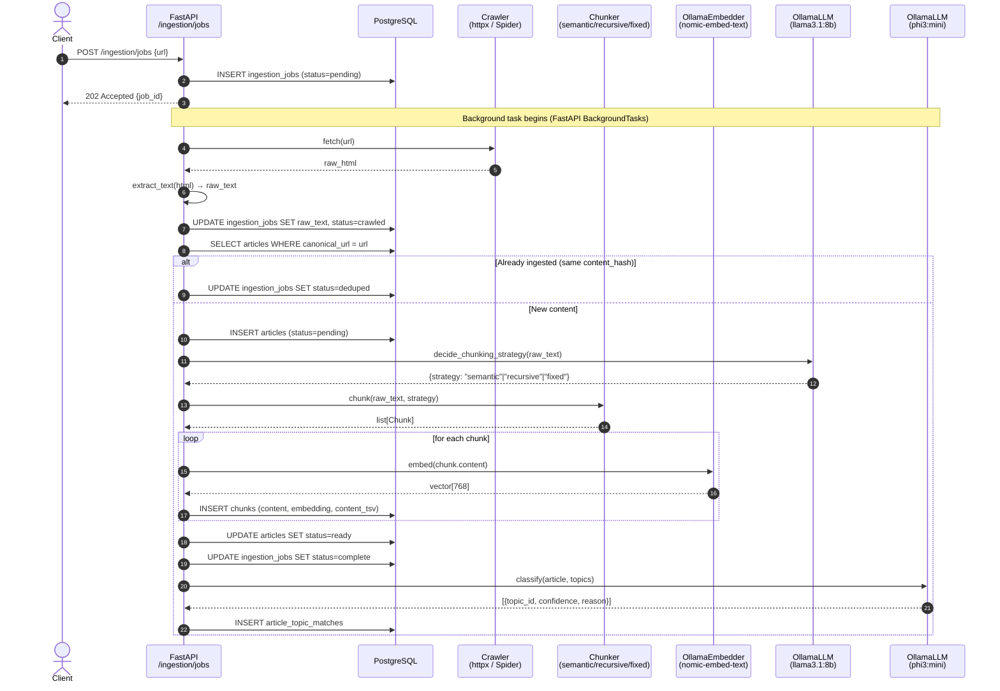
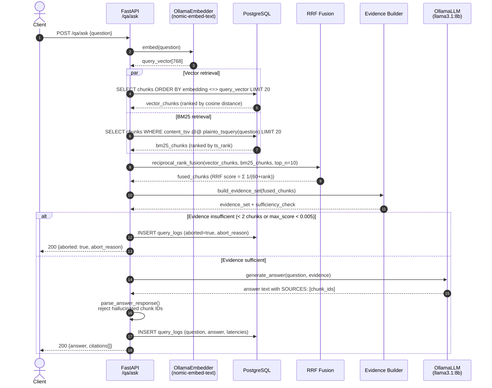
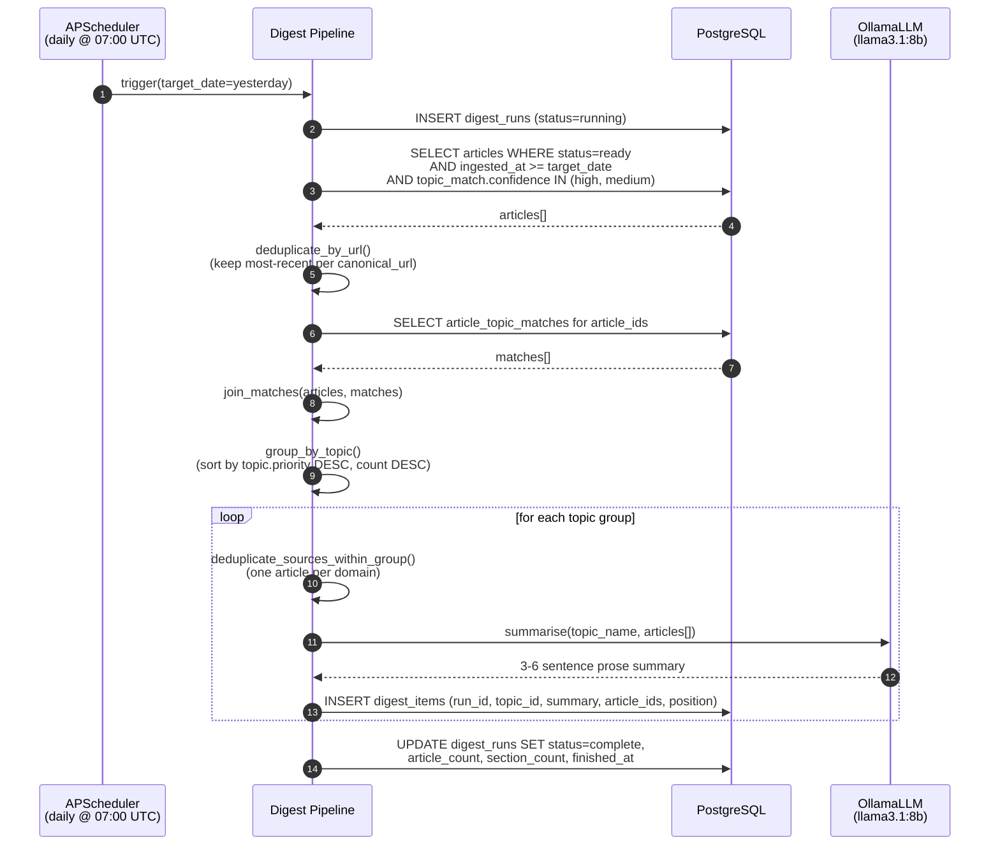
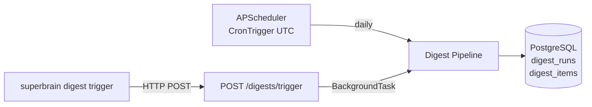
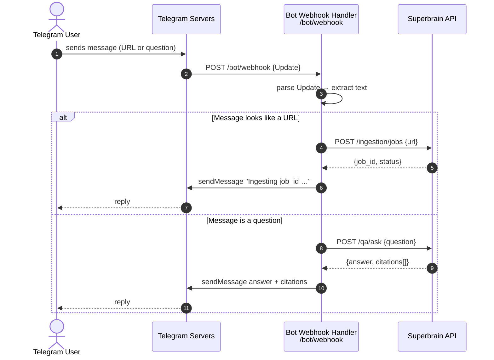
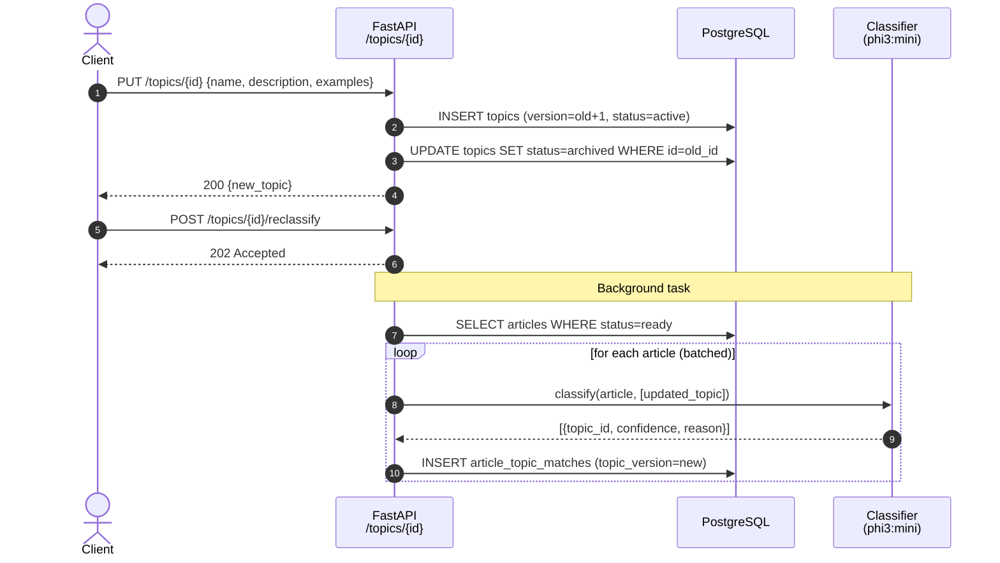

# Superbrain — Data Flow

This document traces how data moves through the system for each major operation. Every diagram shows the full path from entry point to storage (or response), including which services are called, what is persisted, and where asynchronous hand-offs occur.

---

## 1. URL Ingestion

A URL submitted to the API is processed asynchronously in four sequential phases: crawl → chunk → embed → classify.



### What is written to the database

| Table | When | Contents |
|---|---|---|
| `ingestion_jobs` | Immediately on POST | id, input_type, input_value, status=pending |
| `ingestion_jobs` | After crawl | raw_text, status=crawled |
| `ingestion_jobs` | After dedup check | status=deduped (if duplicate) or status=complete |
| `articles` | After dedup check (new only) | url, canonical_url, content_hash, raw_text, title, status=ready |
| `chunks` | After each embedding | content, chunk_index, strategy, token_count, embedding, content_tsv |
| `article_topic_matches` | After classification | article_id, topic_id, topic_version, confidence, reason |
| `model_call_logs` | After each LLM call | request_type, model_name, duration_ms, status |

---

## 2. QA (Question Answering)

A question flows synchronously through retrieval, fusion, evidence gating, and generation — then the full interaction is logged.



### RRF Score Formula

For each chunk appearing in the ranked lists:

```
score = Σ  1 / (60 + rank_i)
```

A chunk that ranks 1st in vector search and 3rd in BM25 gets score `1/61 + 1/63 ≈ 0.032`. A chunk appearing in only one list gets a single term. Chunks are then sorted descending by score and truncated to `top_n=10`.

---

## 3. Digest Generation

The daily digest is a map-reduce pipeline: articles are selected, grouped by topic, deduplicated within each group, then summarised one group at a time.



### Digest trigger paths



---

## 4. Telegram Bot

The Telegram webhook converts a chat message into an ingestion or QA API call and relays the result back to the user.



---

## 5. Topic Lifecycle and Reclassification

When a topic definition changes, all existing articles are re-classified against the updated definition.



---

## 6. Observability Data Flow

Every model call and every QA query is logged to PostgreSQL for later inspection.

```mermaid
graph TD
    subgraph Application Layer
        ING[Ingestion Pipeline]
        QA[QA Pipeline]
        DIGEST[Digest Pipeline]
        CLASS[Classifier]
        METRICS[InMemoryMetricsRecorder]
    end

    subgraph Infrastructure Layer
        LLM_ADAPTER[OllamaLLM Adapter]
        MODEL_LOG_REPO[ModelCallLogRepo]
        QUERY_LOG_REPO[QueryLogRepo]
    end

    subgraph Storage
        DB[(PostgreSQL)]
        MEMORY[(In-process memory)]
    end

    subgraph Observability API
        OBS[GET /observe/metrics<br/>GET /observe/model-calls<br/>GET /observe/query-logs<br/>GET /observe/jobs/trace<br/>GET /observe/evals/run]
    end

    ING -->|increment / observe| METRICS
    QA -->|increment / observe| METRICS
    DIGEST -->|increment / observe| METRICS
    CLASS -->|increment / observe| METRICS

    METRICS --> MEMORY

    LLM_ADAPTER -->|save ModelCallLog| MODEL_LOG_REPO
    QA -->|save QueryLog| QUERY_LOG_REPO
    MODEL_LOG_REPO --> DB
    QUERY_LOG_REPO --> DB

    OBS -->|snapshot()| METRICS
    OBS -->|list_recent()| MODEL_LOG_REPO
    OBS -->|list_recent()| QUERY_LOG_REPO
```

### Metrics collected

| Metric name | Type | Emitted by |
|---|---|---|
| `ingestion_success_total` | counter | Ingestion pipeline |
| `ingestion_failure_total` | counter | Ingestion pipeline |
| `ingestion_dedup_total` | counter | Ingestion pipeline |
| `crawl_latency_ms` | histogram (p50/p95/p99) | Ingestion pipeline |
| `chunk_decision_latency_ms` | histogram | Ingestion pipeline |
| `embedding_latency_ms` | histogram | Ingestion pipeline |
| `classification_success_total` | counter | Classifier |
| `topic_match_count` | histogram | Classifier |
| `retrieval_latency_ms` | histogram | QA pipeline |
| `answer_latency_ms` | histogram | QA pipeline |
| `qa_success_total` | counter | QA pipeline |
| `qa_aborted_total` | counter | QA pipeline |
| `digest_success_total` | counter | Digest pipeline |
| `digest_failure_total` | counter | Digest pipeline |
| `digest_sections_total` | counter | Digest pipeline |
