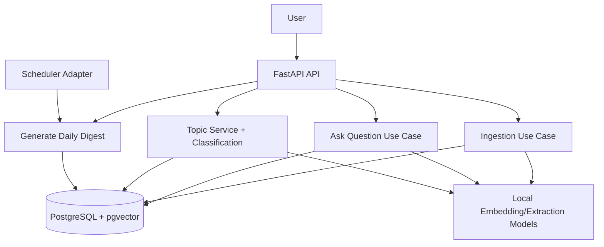
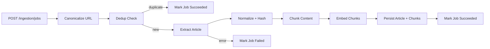
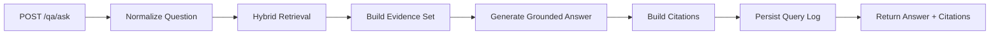
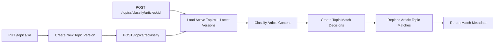

# Flow Diagrams

## System Overview

```mermaid
flowchart TD
    User[User] --> API[FastAPI API]
    API --> Ingestion[Ingestion Use Case]
    API --> QA[Ask Question Use Case]
    API --> Topics[Topic Service + Classification]
    API --> Digest[Generate Daily Digest]

    Ingestion --> DB[(PostgreSQL + pgvector)]
    QA --> DB
    Topics --> DB
    Digest --> DB

    Ingestion --> Models[Local Embedding/Extraction Models]
    QA --> Models
    Topics --> Models

    Scheduler[Scheduler Adapter] --> Digest
```

## Ingestion Flow

```mermaid
flowchart LR
    A[POST /ingestion/jobs] --> B[Canonicalize URL]
    B --> C[Dedup Check]
    C -->|duplicate| D[Mark Job Succeeded]
    C -->|new| E[Extract Article]
    E --> F[Normalize + Hash]
    F --> G[Chunk Content]
    G --> H[Embed Chunks]
    H --> I[Persist Article + Chunks]
    I --> J[Mark Job Succeeded]
    E -->|error| K[Mark Job Failed]
```

## Query Answering Flow

```mermaid
flowchart LR
    A[POST /qa/ask] --> B[Normalize Question]
    B --> C[Hybrid Retrieval]
    C --> D[Build Evidence Set]
    D --> E[Generate Grounded Answer]
    E --> F[Build Citations]
    F --> G[Persist Query Log]
    G --> H[Return Answer + Citations]
```

## Topic Classification Flow

```mermaid
flowchart LR
    A[POST /topics/classify/articles/:id] --> B[Load Active Topics + Latest Versions]
    B --> C[Classify Article Content]
    C --> D[Create Topic Match Decisions]
    D --> E[Replace Article Topic Matches]
    E --> F[Return Match Metadata]

    U[PUT /topics/:id] --> V[Create New Topic Version]
    V --> W[POST /topics/reclassify]
    W --> B
```

## Daily Digest Flow

```mermaid
flowchart LR
    A[POST /digests/trigger] --> B[Create Digest Run]
    B --> C[Select Yesterday's Articles]
    C --> D[Join Topic Matches]
    D --> E[Deduplicate Sources]
    E --> F[Generate Topic Sections]
    F --> G[Persist Digest Items]
    G --> H[Mark Run Succeeded]
    H --> I[Optional Notify Adapter]

    S[Scheduler trigger] --> A
```
